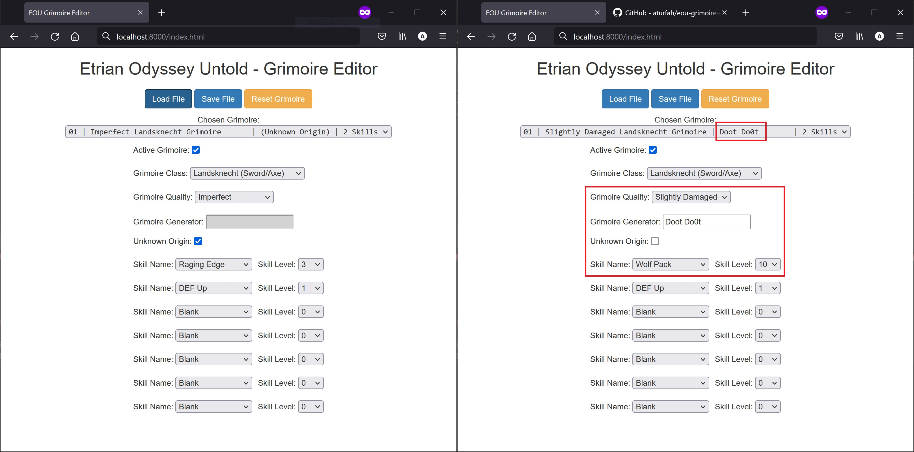
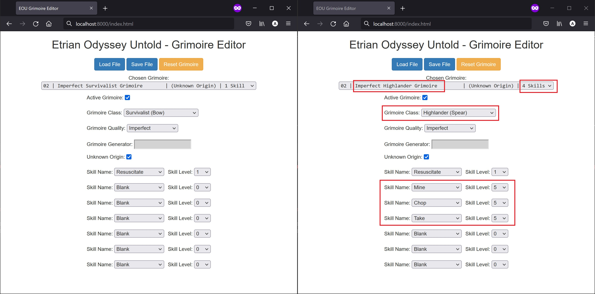
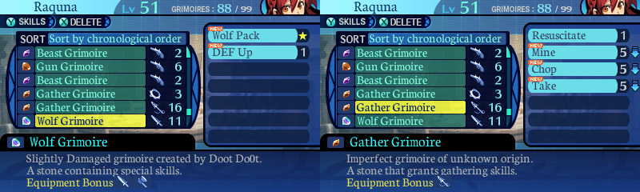

# Etrian Odyssey Untold Grimoire Editor

## Running
### Windows
Run the `eou_grimoire_editor.exe` file from the `dist/` folder. Make sure that the `skill_data/` folder is in the same directory as the executable file, otherwise it will not run.

### Mac/Linux
Requirements:
- Python 3 (with tkinter)
- Basic command line usage

Download the code from this repository navigate to the directory and using the terminal. From there, run the command below
```
python eou_grimoire_editor.py
```

You may need to install tkinter for Python3; this can be done on Ubuntu systems with the following command
```
sudo apt-get install python3-tk
```

## Basic Usage (with pictures!)

Obtain a backup of a save file for the game using `Checkpoint` or a similar tool for the 3DS. The file of interest should be called `mor1rgame.sav`. I strongly suggest backing up this save file in case things go wrong.

Launch the grimoire editor program and load the save file. You should see a screen similar to the one below on the left. I am going to change Raging Edge to Wolf Pack by selecting it from the dropdown. If you want a level 10 Wolf Pack, you can use the dropdown to the side of the skill name and select the desired level, as I have done in the image on the right.

We can also edit the name of the character who generated the grimoire. A blank entry is Unknown origin; in this case I'm going to set the generator to be "Doot Do0t" as dummy text. Prior to doing this, make sure to un-check the `Unkown Origin` checkbox. I'm also going to make the grimoire slightly damaged, even though it has a level 10 skill. Note that the name in the `Chosen Grimoire` dropdown has changed as well to reflect the grimoire origin and quality.

<div align="center">

</div>

You can select another grimoire from the menu on the left to edit multiple grimoires. I've selected the second grimoire in my inventory (the original can be seen on the left) to modify. I added the three gathering skills at level 5 as well as set the class to a spear, as shown on the right. Note that when changing a skill from "Blank," the level will automatically be set to 1. I am going to keep the origin as unknown for this grimoire. Note that the name in the `Chosen Grimoire` dropdown has changed to reflect the class and number of skills.

<div align="center">

</div>

Once complete, use the `Save File` button to save the file with the modified grimoires. After loading the save file, we see the two grimoires in-game below. 

<div align="center">

</div>


## In-depth Explanation of Features

The `Load File` and `Save File` can be used to load and save the game `.sav` file respectively. It is highly recommended to make a back-up of your save file or to not overwrite your original file in case things go wrong. 

On the same line is the orange `Reset Grimoire` button. This will reset the properties of the currently selected grimoire to match the original save file.

The `Chosen Grimoire` dropdown selects the grimoire to be edited. It also updates to reflect changes to grimoires such as quality, class, origin, and number of skills.

The `Active Grimoire` checkbox determines if a grimoire is empty or not. Un-checking the box will disable all editing, and if you save the grimoire will be empty. This can serve to delete a grimoire you so please.

The remainder of the features are straightforward. Note that if `Unknown Origin` is checked, then the grimoire will be 


## Build/Debug

Requirements:
- Python 3
- Pyinstaller

To run the program locally, please use the instructions to run on a Mac/Linux computer.

To build the `.exe` file locally, install [pyinstaller](https://pyinstaller.org/en/stable/) and run the following command
```
python -m eel eou_grimoire_editor.py web --onefile
```
This will generate an executable file in the `dist/` directory (`eou_grimoire_editor.exe`). Make sure that the `skill_data/` folder is in the same directory as the executable file, otherwise it will not run.