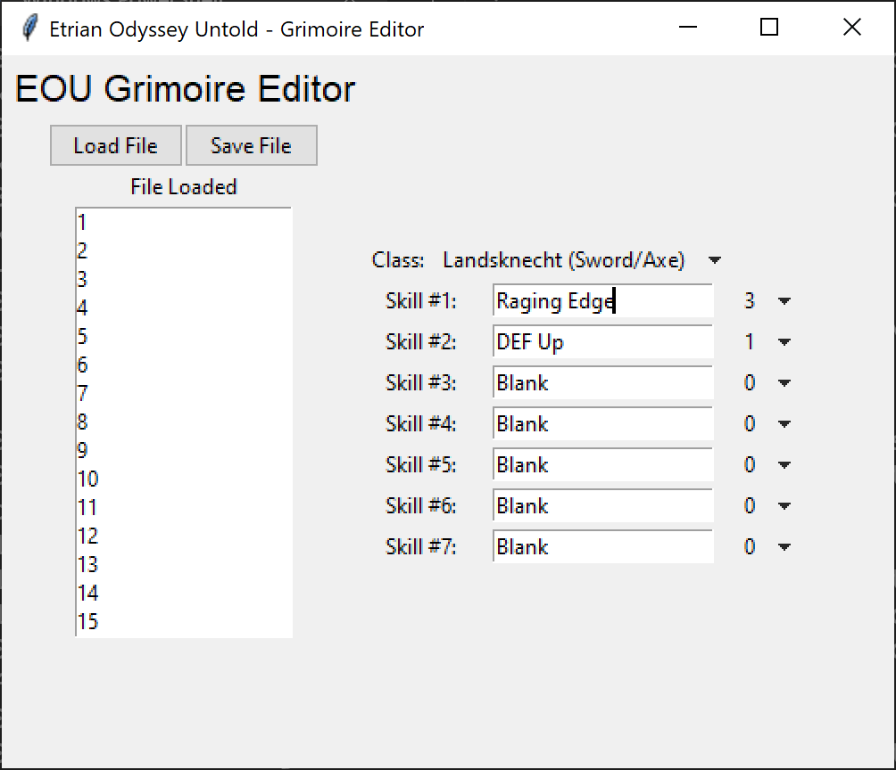
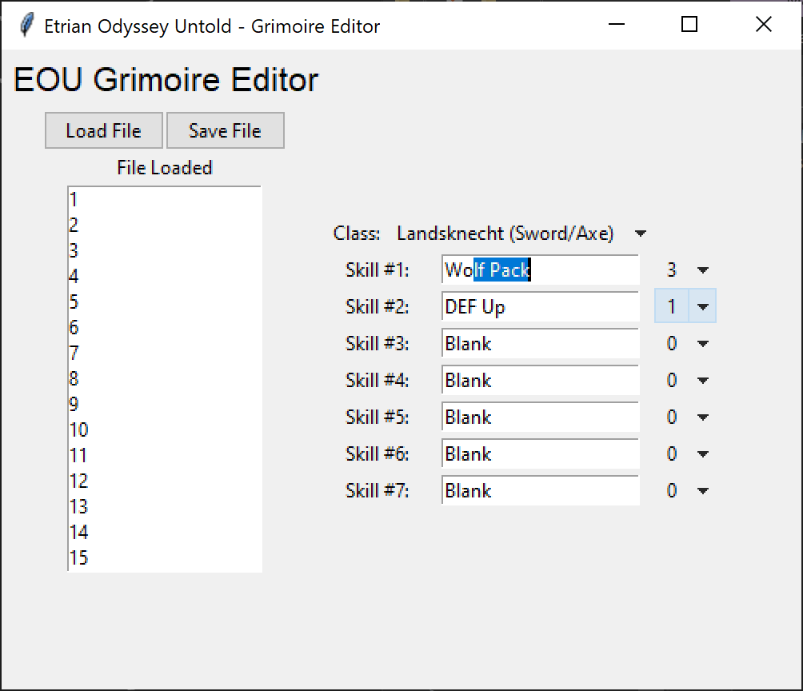
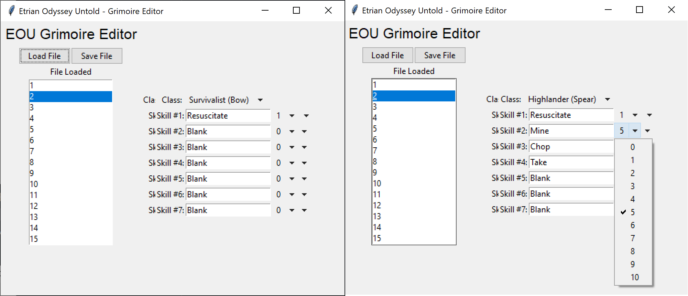
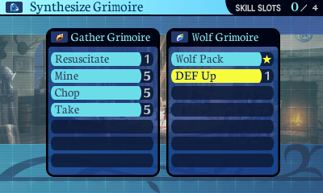
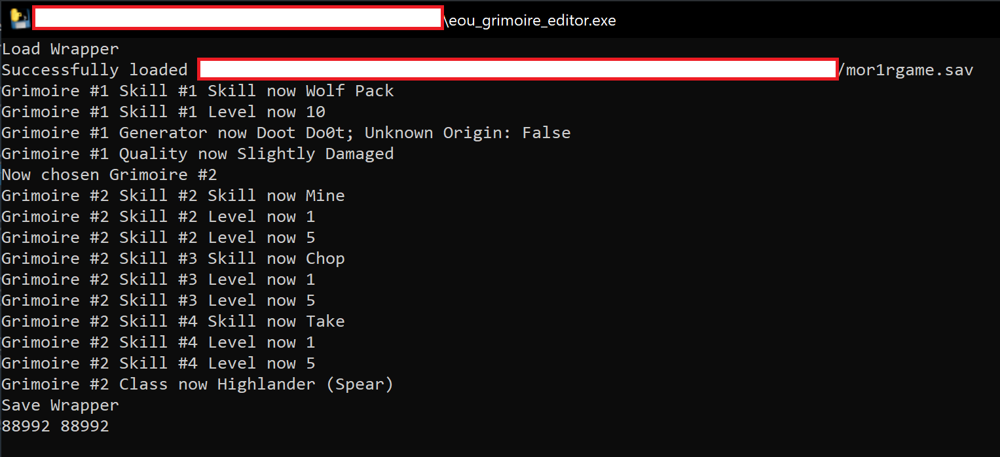

# Etrian Odyssey Untold Grimoire Editor

## Running
### Windows
Run the `eou_grimoire_editor.exe` file from the `dist/` folder. Make sure that the `skill_data/` folder is in the same directory as the executable file, otherwise it will not run.

### Mac/Linux
Requirements:
- Python 3 (with tkinter)
- Basic command line usage

Download the code from this repository navigate to the directory and using the terminal. From there, run the command below
```
python eou_grimoire_editor.py
```


## How to Use (with pictures!)

Obtain a backup of a save file for the game using `Checkpoint` or a similar tool for the 3DS. The file of interest should be called `mor1rgame.sav`. I strongly suggest backing up this save file in case things go wrong.

Launch the grimoire editor program and load the save file. You should see a screen similar to the one below.

<div align="center">

</div>

I am going to change Raging Edge to Wolf Pack; once I begin typing Wolf Pack into the field it should auto-complete. Click `Enter` or `Return` and it should register the new skill. In addition, you can click `Up` or `Down` to cycle through the auto-complete options. If you want a level 10 Wolf Pack, you can use the dropdown to the side of the skill name and select the desired level.

<div align="center">

</div>

You can select another grimoire from the menu on the left to edit multiple grimoires. I've selected the second grimoire and added the three gathering skills at level 5 as well as set the class to a spear; the resulting screen looks as below.

<div align="center">

</div>

After loading the save file back onto my DS, we see the two grimoires in-game below.

<div align="center">

</div>

Finally, as a sanity check the terminal window has a record of the changes made. Note that I forgot to click `Enter` when setting Mine in the second slot so the skill setting occurs after the level setting.

<div align="center">

</div>


## Build/Debug

Requirements:
- Python 3
- Pyinstaller

To build the `.exe` file locally, install [pyinstaller](https://pyinstaller.org/en/stable/) and run the following command
```
pyinstaller.exe --onefile eou_grimoire_editor.py
```
This will generate an executable file in the `dist/` directory (`eou_grimoire_editor.exe`). Make sure that the `skill_data/` folder is in the same directory as the executable file, otherwise it will not run.